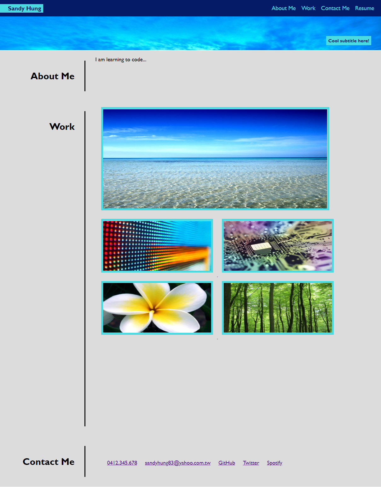

# Sandys-portfolio

## Description

This project aims to build an effective portfolio to showcase the developer's work throughout their learning journey. The web application is built from scratch, applying the skills learned such as CSS variables, Flexbox and media queries. 

In this portfolio, you'll find the developer's name, a bit about themselves, their work and contact details. 
The developer will continue to update their portfolio as they progress through their coding bootcamp and apply new skills learnt in their future works.

## Usage

Below is a screenshot of the deployed webpage

Click on the nagivation list on the top right corner to be directed to the selected selection.
Webpage layout is adaptive to various screensizes to support viewing of the portfolio on different devices.

## Support

Please reach out to Sandy Hung at sandyhung83@yahoo.com.tw if you have any questions or comments regarding this project. Alternatively, head on to my GitHub at https://github.com/Sandy5433 to see more exciting projects.

## Roadmap

New coding projects will be released every Wednesday night. My first project, refactoring html/css code, can be found on my GitHub.

## Contributing

If you would like to contribute to the development of my portfolio this code, you can reach out to me via the contact details on my portfolio webpage. 

## Authors and acknowledgment

Many thanks to my instructors and tutors from USYD coding bootcamp who stayed back after class to support me on my journey in coding.

## Project status

Ongoing. Project commenced 18/11/2022.
